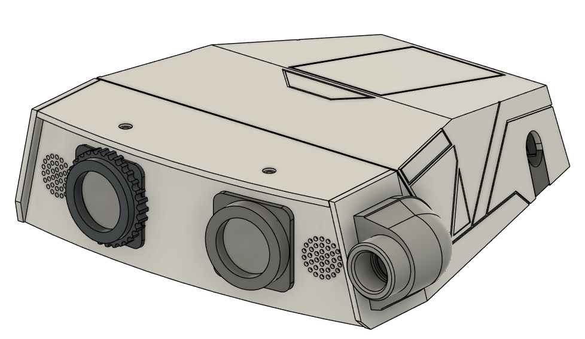

# Justin's Park Head Mod (BD‑X Style)

This mod updates the Open Duck Mini v2 head to more closely resemble the Disney BD‑X design.

- Author: Justin Andrews (Codezombie23)
- Project: Open Duck Mini v2 head mod

Update (20/01/2026)
Experimental version 2.0 of the head is available
Open_Duck_Mini_Park Head_V2 (Experimental).step

Features
- Everything is moved to the baseplate in regards to mounting. (Thanks to Arronax for this mod)
- Intergrated LED mounting, supports classic star style LEDs and Adafruit NeoPixel Jewel.
- Dual or Stereo speaker support at front of head.
- Mounting holes for PiZero, and Teensy Head Board (coming soon)

Currently only available in STEP, STL/3MF files are not being released at this point
Print at your own risk.

If you use or remix this, please credit the author above.
